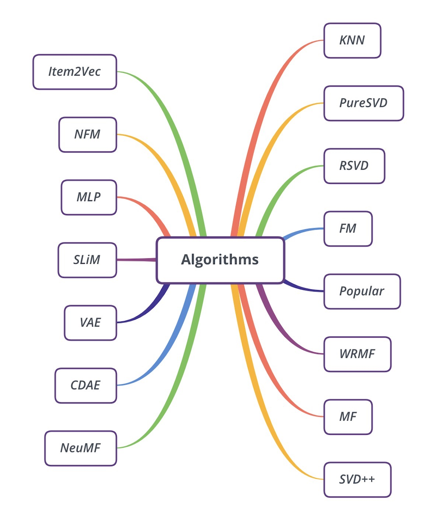

 [](https://github.com/AmazingDD/daisyRec)  

## Overview

<!--  -->

DaisyRec is a Python toolkit dealing with rating prediction and item ranking issue.

The name DAISY (roughly :) ) stands for Multi-**D**imension f**AI**rly comp**A**r**I**son for recommender **SY**stem.

To get all dependencies, run:

    pip install -r requirement.txt

Before running, you need first run: 

    python setup.py build_ext --inplace

to generate `.so` file for `macOS` or `.pyd` file for `WindowsOS` used for further import.

Make sure you have a **CUDA** enviroment to accelarate since these deep-learning models could be based on it.

DaisyRec handled ranking issue mainly and split recommendation problem into point-wise ones and pair-wise ones so that different loss function are constructed such as BPR, Top-1, Hinge and Cross Entropy. All algorithms already implemented are exhibited below:



use `main.py` to achieve KPI results calculated by certain algorithm above. For example, you can implement this program to implement BPR-MF:

    python main.py --problem_type=pair --algo_name=mf --loss_type=BPR --num_ng=2

## TODO list

- [X] DeepFM algorithm module
- [X] AFM algorithm module
- [ ] weight initialization interface

<!-- ## Cite

Here is a Bibtex entry if you ever need to cite **DaisyRec** in a research paper (please keep us posted, we would love to know if Daisy was helpful to you)

```
@misc{yudi2020daisyrec,
  title={DaisyRec},
  author={Yu Di},
  year={2020},
  publisher={GitHub},
  howpublished={\url{https://github.com/AmazingDD/daisyRec}},
}
```

-->

<!-- ## Appendix

**Reference**

* SLIM: Sparse Linear Methods for Top-N Recommender Systems
* Probabilistic matrix factorization
* Performance of recommender algorithms on top-N recommendation tasks
* Factorization meets the neighborhood: a multifaceted collaborative filtering model
* Collaborative Filtering for Implicit Feedback Datasets
* BPR: Bayesian Personalized Ranking from Implicit Feedback

* Factorization Machines
* Neural Factorization Machines for Sparse Predictive Analytics
* Neural Collaborative Filtering
* Item2Vec: Neural Item Embedding for Collaborative Filtering
* AutoRec: Autoencoders Meet Collaborative Filtering -->
<!-- | eALS | EALSRecommender.py | Fast Matrix Factorization for Online Recommendation with Implicit Feedback | -->
