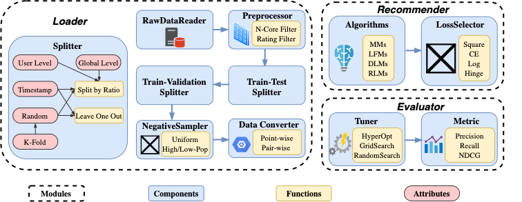
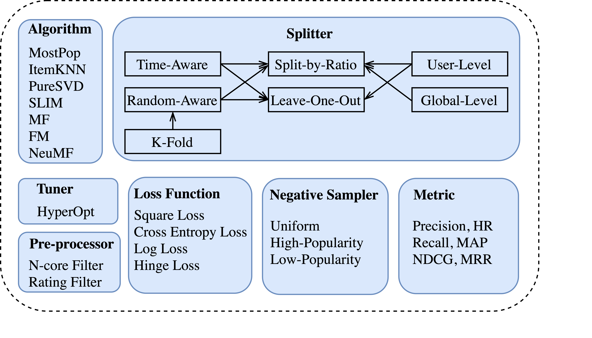
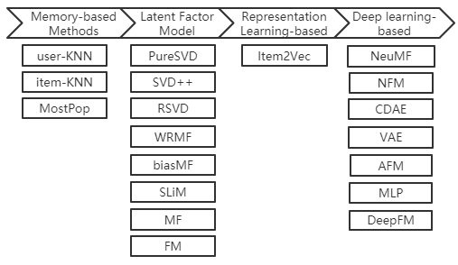

 [](https://github.com/AmazingDD/daisyRec)  

## Overview

<!--  -->

DaisyRec is a Python toolkit dealing with rating prediction and item ranking issue.

The name DAISY (roughly :) ) stands for multi-**D**imension f**A**irly compAr**I**son for recommender **SY**stem.



To get all dependencies, run:

    pip install -r requirement.txt

Before running, you need first run: 

    python setup.py build_ext --inplace

to generate `.so` or `.pyd` file used for further import.

Make sure you have a **CUDA** enviroment to accelarate since these deep-learning models could be based on it. We will consistently update this repo.

DaisyRec handled ranking issue mainly and split recommendation problem into point-wise ones and pair-wise ones so that different loss function are constructed such as BPR, Top-1, Hinge and Cross Entropy. All algorithms already implemented are exhibited below:



use `main.py` to achieve KPI results calculated by certain algorithm above. For example, you can implement this program to implement BPR-MF:

    python main.py --problem_type=pair --algo_name=mf --loss_type=BPR --num_ng=2

All experiments code and data links implemented in our paper are exhibited in `master` branch. Please check out to `master` if you are interested.

## TODO list

- [x] user-level time-aware fold-out method
- [x] user-level/item-level/user-item-level N-core
- [x] distinguish N-filter and N-core preprocess method
- [ ] weight initialization interface

## Cite

Here is a Bibtex entry if you ever need to cite **DaisyRec** in a research paper (please keep us posted, we would love to know if Daisy was helpful to you)

```
@inproceedings{sun2020are,
  title={Are We Evaluating Rigorously? Benchmarking Recommendation for Reproducible Evaluation and Fair Comparison},
  author={Sun, Zhu and Yu, Di and Fang, Hui and Yang, Jie and Qu, Xinghua and Zhang, Jie and Geng, Cong},
  booktitle={Proceedings of the 14th ACM Conference on Recommender Systems},
  year={2020}
}
<!--
@misc{yudi2020daisyrec,
  title={Are We Evaluating Rigorously? Benchmarking Recommendation for Reproducible Evaluation and Fair Comparison},
  author={Zhu Sun, Yu Di, Hui Fang, Jie Yang, Xinghua Qu, Jie Zhang, Cong Geng},
  year={2020},
  publisher={GitHub},
  howpublished={\url{https://github.com/AmazingDD/daisyRec}},
}
-->
```
