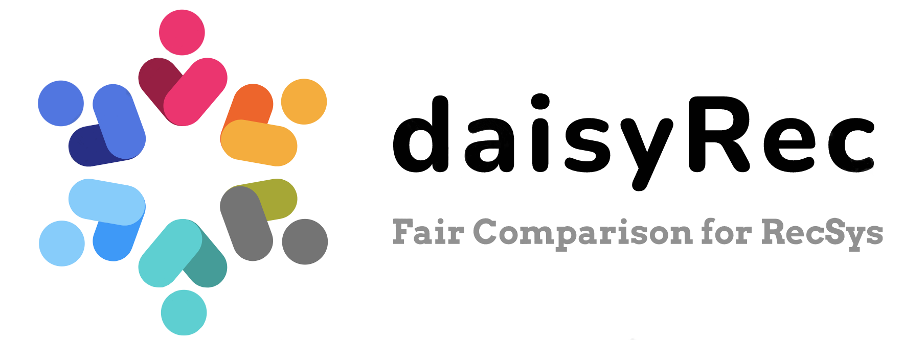

<p align="left">

</p>

 
[](https://github.com/AmazingDD/daisyRec) 
 

[](https://arxiv.org/abs/2206.10848)

### Overview

daisyRec is a Python toolkit developed for benchmarking top-N recommendation task. The name DAISY stands for multi-**D**imension f**A**ir compar**I**son for recommender **SY**stem. ***(Please note that DaisyRec is still under testing. If there is any issue, please feel free to let us know)*** 

The figure below shows the overall framework of DaisyRec. 

<p align="center">

</p>

This repository is used for publishing. If you are interested in details of our _experiments ranking results_, try to reach this [**repo file**](https://github.com/recsys-benchmark/DaisyRec-v2.0/blob/dev/appendix.pdf). 

We really appreciate these repositories to help us improve the code efficiency:
  - [RecSys2019_DeepLearning_Evaluation](https://github.com/MaurizioFD/RecSys2019_DeepLearning_Evaluation)
  - [NGCF-PyTorch](https://github.com/huangtinglin/NGCF-PyTorch)
  - [RecBole](https://github.com/RUCAIBox/RecBole)

### How to Run

Make sure you have a **CUDA** enviroment to accelarate since the deep-learning models could be based on it. 

#### 1. Install from pip
```
pip install daisyRec
```

#### 2. Clone from github
```
git clone https://github.com/AmazingDD/daisyRec.git && cd daisyRec
```

- Example codes are listed in `run_examples`, try to refer them and find out how to use daisy; you can also implement these codes by moving them into `daisyRec/`.
  ```
  python test.py
  python tune.py
  ```
- The GUI Command Generator for `test.py` and `tune.py`, which can assist you to quikly write arguments and run the fair comparison experiments, is now available [**here**](https://daisyrec.netlify.app/).


### Documentation 

The documentation of DaisyRec is available [here](https://daisyrec.readthedocs.io/en/latest/), which provides detailed explanations for all arguments.

### Implemented Algorithms

Models in daisyRec only take triples _<user, item, rating>_ into account, so FM-related models will be specialized accrodingly.
Below are the algorithms implemented in daisyRec. More baselines will be added later.

| **Model** | **Publication** |
|-----------|-----------------|
| MostPop   | A re-visit of the popularity baseline in recommender systems |
| ItemKNN   | Item-based top-N recommendation algorithms |
| EASE      | Embarrassingly Shallow Autoencoders for Sparse Data |
| PureSVD   | Top-n recommender system via matrix completion |
| SLIM      | SLIM: Sparse Linear Methods for Top-N Recommender Systems |
| MF        | Matrix factorization techniques for recommender systems |
| FM        | Factorization Machines |
| NeuMF     | Neural Collaborative Filtering |
| NFM       | Neural Factorization Machines for Sparse Predictive Analytics |
| NGCF      | Neural Graph Collaborative Filtering |
| Multi-VAE | Variational Autoencoders for Collaborative Filtering |
| Item2Vec  | Item2vec: neural item embedding for collaborative filtering |
| LightGCN  | LightGCN: Simplifying and Powering Graph Convolution Network for Recommendation |

### Datasets

You can download experiment data, and put them into the `data` folder.
All data are available in links below: 

  - MovieLens-[100K](https://grouplens.org/datasets/movielens/100k/) / [1M](https://grouplens.org/datasets/movielens/1m/) / [10M](https://grouplens.org/datasets/movielens/10m/) / [20M](https://grouplens.org/datasets/movielens/20m/)
  - [Netflix Prize Data](https://archive.org/download/nf_prize_dataset.tar)
  - [Last.fm](https://grouplens.org/datasets/hetrec-2011/)
  - [Book Crossing](https://grouplens.org/datasets/book-crossing/)
  - [Epinions](http://www.cse.msu.edu/~tangjili/trust.html)
  - [CiteULike](https://github.com/js05212/citeulike-a)
  - [Amazon-Book/Electronic/Clothing/Music ](http://jmcauley.ucsd.edu/data/amazon/links.html)(ratings only)
  - [Yelp Challenge](https://kaggle.com/yelp-dataset/yelp-dataset)


### Cite

Please cite both of the following papers if you use **DaisyRec** in a research paper in any way (e.g., code and ranking results):

```
@inproceedings{sun2020are,
  title={Are We Evaluating Rigorously? Benchmarking Recommendation for Reproducible Evaluation and Fair Comparison},
  author={Sun, Zhu and Yu, Di and Fang, Hui and Yang, Jie and Qu, Xinghua and Zhang, Jie and Geng, Cong},
  booktitle={Proceedings of the 14th ACM Conference on Recommender Systems},
  year={2020}
}

```

```
@article{sun2022daisyrec,
  title={DaisyRec 2.0: Benchmarking Recommendation for Rigorous Evaluation},
  author={Sun, Zhu and Fang, Hui and Yang, Jie and Qu, Xinghua and Liu, Hongyang and Yu, Di and Ong, Yew-Soon and Zhang, Jie},
  journal={arXiv preprint arXiv:2206.10848},
  year={2022}
}
```
