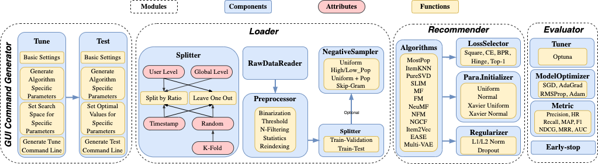

<p align="left">

</p>

 
[](https://github.com/AmazingDD/daisyRec) 
 

[](https://arxiv.org/abs/2206.10848)

## Overview

<!--  -->

daisyRec is a Python toolkit developed for benchmarking top-N recommendation task. The name DAISY stands for multi-**D**imension f**A**irly compar**I**son for recommender **SY**stem. ***(Please note that DaisyRec-v2.0 is still under testing. If there is any issue, please feel free to let us know)*** 

The figure below shows the overall framework of DaisyRec-v2.0. 

<p align="center">

</p>


## Tutorial - How to use DaisyRec-v2.0

### Pre-requisits

Make sure you have a **CUDA** enviroment to accelarate since the deep-learning models could be based on it. 

<!---->

### How to Run

```
python run_examples/fair_rec.py
```

- The GUI Command Generator is available [here](http://DaisyRecGuiCommandGenerator.pythonanywhere.com).


## Documentation 

The documentation of DaisyRec-v2.0 is available [here](https://daisyrec.readthedocs.io/en/latest/), which provides detailed explainations for all commands.

## Implemented Algorithms

Below are the algorithms implemented in daisyRec. More baselines will be added later.

- **Memory-based Methods**
    - MostPop, ItemKNN, EASE
- **Latent Factor Methods**
    - PureSVD, SLIM, MF, FM
- **Deep Learning Methods**
    - NeuMF, NFM, NGCF, Multi-VAE, ∞-AE
- **Representation Methods**
    - Item2Vec
    

## Datasets

You can download experiment data, and put them into the `data` folder.
All data are available in links below: 

  - [MovieLens 100K](https://grouplens.org/datasets/movielens/100k/), [MovieLens 1M](https://grouplens.org/datasets/movielens/1m/), [MovieLens 10M](https://grouplens.org/datasets/movielens/10m/), [MovieLens 20M](https://grouplens.org/datasets/movielens/20m/)
  - [Netflix Prize Data](https://archive.org/download/nf_prize_dataset.tar)
  - [Last.fm](https://grouplens.org/datasets/hetrec-2011/)
  - [Book Crossing](https://grouplens.org/datasets/book-crossing/)
  - [Epinions](http://www.cse.msu.edu/~tangjili/trust.html)
  - [CiteULike](https://github.com/js05212/citeulike-a)
  - [Amazon-Book/Electronic/Clothing/Music (ratings only)](http://jmcauley.ucsd.edu/data/amazon/links.html)
  - [Yelp Challenge](https://kaggle.com/yelp-dataset/yelp-dataset)


## TODO List

- [ ] A more friendly GUI command generator
- [ ] Add [∞-AE](https://arxiv.org/pdf/2206.02626.pdf) (with [code](https://github.com/noveens/infinite_ae_cf)) 
- [ ] add logger
- [ ] release to Pypi
- [ ] add download function in RawDataReader

## Cite

Please cite both of the following papers if you use **DaisyRec** in a research paper in any way (e.g., code and ranking results):

```
@inproceedings{sun2020are,
  title={Are We Evaluating Rigorously? Benchmarking Recommendation for Reproducible Evaluation and Fair Comparison},
  author={Sun, Zhu and Yu, Di and Fang, Hui and Yang, Jie and Qu, Xinghua and Zhang, Jie and Geng, Cong},
  booktitle={Proceedings of the 14th ACM Conference on Recommender Systems},
  year={2020}
}

```

```
@article{sun2022daisyrec,
  title={DaisyRec 2.0: Benchmarking Recommendation for Rigorous Evaluation},
  author={Sun, Zhu and Fang, Hui and Yang, Jie and Qu, Xinghua and Liu, Hongyang and Yu, Di and Ong, Yew-Soon and Zhang, Jie},
  journal={arXiv preprint arXiv:2206.10848},
  year={2022}
}
```

## Acknowledgements

We refer to the following repositories to improve our code:

 - SLIM and KNN-CF parts with [RecSys2019_DeepLearning_Evaluation](https://github.com/MaurizioFD/RecSys2019_DeepLearning_Evaluation)
 - NGCF part with [NGCF-PyTorch](https://github.com/huangtinglin/NGCF-PyTorch)
